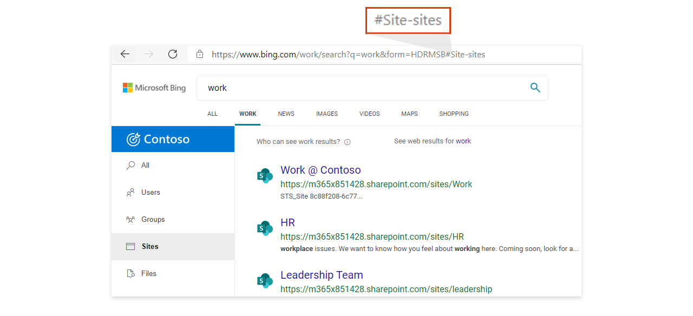

# Add a search box to your intranet site

To provide your users with easy access to results from your organization, add a Microsoft Search in Bing search box to any intranet site or page. These are some of the benefits:

- A search box on your SharePoint or intranet portal provides a familiar, trusted entry point to start searching
- Supports all major web browsers, including Google Chrome and Microsoft Edge
- Only search suggestions from your organization appear, web suggestions are never included
- Takes users to a Microsoft Search in Bing work results page, which excludes ads and web results
- You control the appearance and behavior of the search box, including the ability to land users on a default vertical or a custom vertical you've created
  
## Add a search box to an intranet page

You need to add two elements to the page: a container for the search box and the script that powers it.
  
```html
<div id="bfb_searchbox"></div>
<script>
    var bfbSearchBoxConfig = {
        containerSelector: "bfb_searchbox"
    };
</script>
<script async src="https://www.bing.com/business/s?k=sb"></script>
```

On a SharePoint classic site, add a Script Editor Web Part and drop the script in it.
  
## Enable the search box for mobile

For intranet sites or pages available to mobile users, add isMobile: true to the settings object:
  
```html
<div id="bfb_searchbox"></div>
<script>
    var bfbSearchBoxConfig = {
        containerSelector: "bfb_searchbox", 
        isMobile: true
    };
</script>
<script async src="https://www.bing.com/business/s?k=sb"></script>
```

## Put focus on the search box by default

To help users search faster, when the page or site loads place the cursor in the search box by adding focus: true to the settings object:
  
```html
<div id="bfb_searchbox"></div>
<script>
    var bfbSearchBoxConfig = {
        containerSelector: "bfb_searchbox",
        focus: true
    };
</script>
<script async src="https://www.bing.com/business/s?k=sb"></script>
```

## Customize the appearance of the search box 

To help the search box better fit with the style of your intranet, there are a variety of configuration options you can use. Mix and match options to suit your needs.

```html
<div id="bfb_searchbox"></div>
<script>
    var bfbSearchBoxConfig = {
        containerSelector: "bfb_searchbox",
        width: 560,                             // default: 560, min: 360, max: 650
        height: 40,                             // default: 40, min: 40, max: 72
        cornerRadius: 6,                        // default: 6, min: 0, max: 25                                   
        strokeOutline: true,                    // default: true
        dropShadow: true,                       // default: false
        iconColor: "#067FA6",                   // default: #067FA6
        title: "Search box",                    // default: "Search box"
        vertical: "Person-people",              // default: not specified, search box directs to the All vertical on the WORK results page
        companyNameInGhostText: "Contoso"       // default: not specified
                                                // when absent, ghost text will be "Search work"
                                                // when specified, text will be "Search <companyNameInGhostText>"
    };
</script>
<script async src="https://www.bing.com/business/s?k=sb"></script>
```

## Direct users to a default or custom vertical

To provide easy integration between your line-of-business apps or intranet sites and your work results, you can also customize the search box by specifying a default or custom vertical that users should land on when they click a search suggestion.

Use the vertical option in bfbSearchBoxConfig to define the vertical you want. For example, if you want users to always land on the Sites vertical, one of the default verticals, use the value "Site-sites".



For custom verticals, use the hash at the end of the URL. You can find these values by searching from the work page on Bing, clicking a vertical label, and copying the value after the number sign (#).


## Use an iFrame to embed a search box

If embedding a script isn't an option for the site, use an iFrame to add the search box. You won't be able to customize the search box.
  
```html
<iframe width="564" height="400" src="https://www.bing.com/business/searchbox"></iframe>
```

## InPrivate mode and Conditional Access

An embedded search box will be disabled if the page or site is opened in an InPrivate window. Also, with Azure AD Conditional Access support in Microsoft Edge, Bing.com doesn't support AAD sign in when using InPrivate mode. For more information about Conditional Access in Edge, see [Microsoft Edge and Conditional Access](https://docs.microsoft.com/deployedge/ms-edge-security-conditional-access#accessing-conditional-access-protected-resources-in-microsoft-edge). 