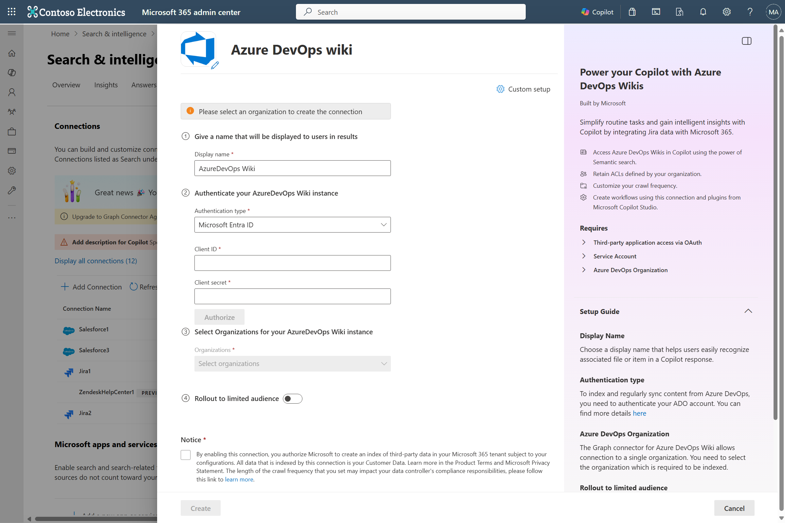
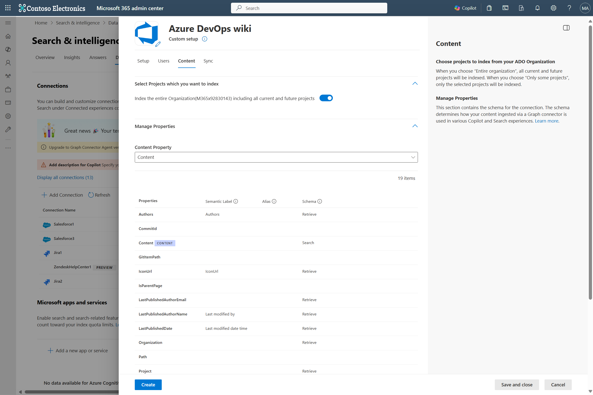
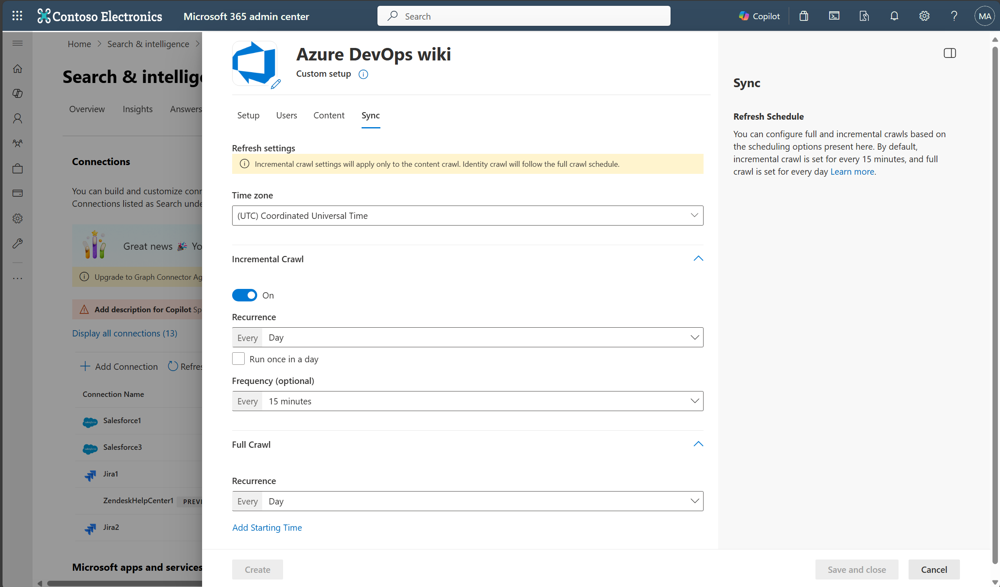

--- 
title: "Azure DevOps Wiki Microsoft Graph connector for Microsoft Search and Microsoft 365 Copilot" 
ms.author: vivg 
author: vivg 
manager: harshkum 
audience: Admin
ms.audience: Admin 
ms.topic: article 
ms.service: mssearch 
ms.localizationpriority: Medium 
search.appverid: 
- BFB160 
- MET150 
- MOE150 
description: "Set up the Azure DevOps Wiki Microsoft Graph connector for Microsoft Search and Microsoft 365 Copilot"
ms.date: 06/03/2022
---

# Azure DevOps Wiki Microsoft Graph connector

The Azure DevOps Wiki Microsoft Graph connector allows your organization to index wikis in its instance of the Azure DevOps service. After you configure the connector, end users can search for project wikis and code wikis from Azure DevOps in Microsoft Search and Microsoft 365 Copilot.

This article is for Microsoft 365 administrators or anyone who configures, runs, and monitors an Azure DevOps Wiki Microsoft Graph connector.

>[!IMPORTANT]
>The Azure DevOps Wiki Microsoft Graph connector supports only the Azure DevOps cloud service. Azure DevOps Server 2019, TFS 2018, TFS 2017, TFS 2015, and TFS 2013 are not supported by this connector.

## Capabilities
- Index wikis from Azure DevOps
- Enable your end users to ask questions related to project wikis and code wikis.
- Use [Semantic search in Copilot](semantic-index-for-copilot.md) to enable users to find relevant content based on keywords, personal preferences, and social connections.

## Limitations
- The connector only indexes one ADO organization per connection. 

## Prerequisites
- You must be the **search admin** for your organization's Microsoft 365 tenant.
- To allow the connector to connect to your Azure DevOps organization, you must enable **Third-party application access via OAuth**. Refer Azure DevOps documentation to [manage security policies](/azure/devops/organizations/accounts/change-application-access-policies?view=azure-devops#manage-a-policy&preserve-view=true) to learn more.

    

- **Service Account**: To connect to Azure DevOps and allow the Microsoft Graph Connector to update wikis regularly, you need a service account with the following permissions granted to it.

    | Permission name | Permission type | Required for |
    | ------------ | ------------ | ------------ |
    | View project-level information | [Project permission](/azure/devops/organizations/security/permissions?view=azure-devops&tabs=preview-page#project-level-permissions&preserve-view=true) | Crawling Azure DevOps Work Items. This permission is **mandatory** for the projects that need to be indexed. |

    >[!IMPORTANT]
    >The service account must have **Basic** access level. To learn more about access levels in Azure DevOps, read [supported access levels](/azure/devops/organizations/security/access-levels).

## Get Started

### 1. Display name 
A display name is used to identify each citation in Copilot, helping users easily recognize the associated file or item. Display name also signifies trusted content. Display name is also used as a [content source filter](/MicrosoftSearch/custom-filters#content-source-filters). A default value is present for this field, but you can customize it to a name that users in your organization recognize.

### 2. Authentication type
To authenticate and sync wikis from Azure DevOps, choose **one of the two** supported methods: 

> [!IMPORTANT]
> - [Microsoft Entra ID OAuth](/azure/devops/integrate/get-started/authentication/oauth?preserve-view=true&view=azure-devops) is in preview and available to select customers. This is the **recommended** OAuth mechanism.
> - [Azure DevOps OAuth](/azure/devops/integrate/get-started/authentication/oauth?preserve-view=true&view=azure-devops) is the legacy authentication mechanism, not being actively invested upon.

#### a. **Microsoft Entra ID OAuth (Preview)**

**Ensure your ADO Organization is connected to Microsoft Entra**

The Azure DevOps Graph connector only indexes content from an ADO organization connected with Microsoft Entra of your tenant. To ensure that your ADO organization is connected with Microsoft Entra account, use the following steps. 

1. Navigate to [Azure DevOps](https://dev.azure.com/) and select the required organization.
2. Select `Organization settings`.
3. On the left navigation pane, select `Microsoft Entra` under the 'General' header.
4. Ensure that the organization is connected to your tenant's Microsoft Entra account.

**Create an app on Microsoft Entra ID**

1. Go to the [Azure portal](https://portal.azure.com) and sign in with admin credentials for the tenant.
2. Navigate to **Microsoft Entra ID** -> **Manage** -> **App registrations** from the navigation pane and select **New registration**.
3. Provide a name for the app and select **Register**.
4. Make a note of the Application (client) ID. This ID is used to grant the Microsoft Entra app access to projects in the ADO organization.
5. Open **API permissions** from the navigation pane and select **Add a permission**.
6. Select **Azure DevOps** and then **Delegated permissions**.
7. Search for the following permissions and select **Add permissions**.  
    a. Identity (read)  
    b. Code (read)  
    c. Entitlements (read)  
    d. Project and Team (read)  
    e. Graph (read)  
    f. MemberEntitlement Management (read)  
    g. Wiki (read)
8. Select **Grant admin consent for [TenantName]** and confirm by selecting **Yes**.
9. Check that the permissions are in the "**Granted**" state.
10. Open **Authentication** from the navigation pane. Select `Add a platform` and choose `Web`. Add one of the following URIs under "Redirect URIs":
    - For **M365 Enterprise**: `https://gcs.office.com/v1.0/admin/oauth/callback`
    - For **M365 Government**: `https://gcsgcc.office.com/v1.0/admin/oauth/callback`
11. Under **Implicit grant and hybrid flows**, check the option for `ID tokens (used for implicit and hybrid flows)` and click **Configure**.
12. From the navigation pane, select **Certificates and secrets** under **Manage**.
13. Select **New Client secret** and select an expiry period for the secret. Copy the generated secret (Value) and save it because it isn't shown again.
14. Use this Client secret and the application ID to configure the connector.

**Grant the Microsoft Entra app access to projects in the ADO organization**

You need to provide the Microsoft Entra app the necessary access to the projects which need to be indexed using the following steps:

1. Navigate to [Azure DevOps](https://dev.azure.com/) and select the required organization.
2. Select `Organization settings`.
3. On the left navigation pane, select `Users` under the 'General' header.
4. Select `Add users`.
5. Copy the Application (client) ID obtained from the app to "Users or Service Principals".
6. Grant the `Basic` access level and select the projects to allow access to index. Also add to the `Project Reader` Azure DevOps group (or equivalent) to ensure access. De-select the option to send email invitation to users.

### Azure DevOps OAuth

To connect to your Azure DevOps instance, you need your Azure DevOps organization App ID and client secret for OAuth authentication.

**Register an app**

Register an app in Azure DevOps so that the Microsoft Search app and Microsoft 365 Copilot can access the instance. To register the app, visit the link to [register application]( https://app.vsaex.visualstudio.com/app/register). To learn more, see Azure DevOps documentation on how to [register an app](/azure/devops/integrate/get-started/authentication/oauth?preserve-view=true&view=azure-devops#register-your-app).

The following table provides guidance on how to fill out the app registration form:

Mandatory fields | Description | Recommended value
--- | --- | ---
| Company name         | The name of your company. | Use an appropriate value.|
| Application name     | A unique value that identifies the application that you're authorizing.    | Microsoft Search.|
| Application website  | The URL of the application that requests access to your Azure DevOps instance during connector setup. (required).| For **Microsoft 365 Enterprise**: https://gcs.office.com/,  For **Microsoft 365 Government**: https://gcsgcc.office.com/|
| Authorization callback URL| A required callback URL that the authorization server redirects to. | For **Microsoft 365 Enterprise**: https://gcs.office.com/v1.0/admin/oauth/callback,  For **Microsoft 365 Government**: https://gcsgcc.office.com/v1.0/admin/oauth/callback|
| Authorized scopes | The scope of access for the application | Select the following scopes: Identity (read), Code (read), Entitlements (read), Project and Team (read), Graph (read), Member Entitlement Management (read), Wiki (read).|

>[!IMPORTANT]
>The authorized scopes selected for the app should exactly match the scopes listed above. If either more or less scopes are selected, authorization fails.

On registering the app, you get the **App ID** and **Client Secret** that is used to configure the connector.

To revoke access to any app registered in Azure DevOps, go to User settings at the right top of your Azure DevOps instance. Select **Profile** and then select **Authorizations** in the Security section of the side pane. Hover over an authorized OAuth app to see the Revoke button at the corner of the app details.

### 3. Select Organization
The Azure DevOps connector allows indexing of one organization per connection. To connect to your Azure DevOps service, select the right organization from the list of organizations accessible to the service account.

### 4. Roll out to limited audience
Deploy this connection to a limited user base if you want to validate it in Copilot and other Search surfaces before expanding the rollout to a broader audience. To know more about limited rollout, see [staged rollout](staged-rollout-for-graph-connectors.md).

At this point, you're ready to create the connection for Azure DevOps wikis. You can click **Create** to publish your connection and index wikis from your Azure DevOps organization.

For other settings, like **Access Permissions**, **Data Inclusion Rules**, **Schema**, **Crawl frequency**, etc., we have defaults based on what works best with ADO data. You can see the default values below:

| Users | Description |
|----|---|
| Access permissions | _Only people with access to content in Data source._ |
| Map Identities | _Data source identities mapped using Microsoft Entra IDs._ |

| Content | Description |
|---|---|
| Site projects | _All projects are indexed._ |
| Manage Properties | _To check default properties and their schema, see [content](#content)_ |

| Sync | Description |
|---|---|
| Incremental Crawl | _Frequency: Every 15 mins_ |
| Full Crawl | _Frequency: Every Day_ |

If you want to edit any of these values, you need to choose the "Custom Setup" 

## Custom Setup

Custom setup is for those admins who want to edit the default values for settings listed in the above table. Once you click on the "Custom Setup" option, you see three more tabs - Users, Content, and Sync.

### Users

**Access Permissions**

The Azure DevOps Wiki connector supports search permissions visible to **Everyone** or **Only people with access to this data source**. If you choose **Everyone**, indexed data appears in the search results for all users. If you choose **Only people with access to this data source**, indexed data appears in the search results for users who have access to them.

>[!NOTE]
>
> Updates to groups governing access permissions are synced in full crawls only. Incremental crawls don't support processing of updates to permissions.

### Content

**Choose projects**

In this step, you specify the scope of data that you want to index using the Azure DevOps Wiki Microsoft Graph connector. You can then choose for the connection to index either the entire organization or specific projects within the selected organization.

If you choose to index the entire organization, wikis in all projects in the organization are indexed. New projects and wikis are indexed during the next crawl after they're created.

If you choose to index individual projects, only wikis in the selected projects are indexed.

**Manage Properties**

Here, you can add or remove available properties from your Azure DevOps data source, assign a schema to the property (define whether a property is searchable, queryable, retrievable, or refinable), change the semantic label and add an alias to the property. Properties that are selected by default are listed below.

|Source Property|Label|Description|Schema|
|---|---|---|---|
| Authors | Authors | Name all the people who participated/collaborated on the item in the data source | Retrieve |
| CommitId | | | |
| Content | Content | The content body of the wiki | Search |
| GitItemPath | | | |
| IconUrl | IconUrl | Icon url that represents the wiki | Retrieve |
| isParentPage | | | |
| LastPublishedAuthorEmail | Last modified by | | Retrieve |
| LastPublishedDate | Last modified date time | Date and time the item was last modified in the data source | Retrive |
| Organization | | | Retrieve |
| Path | | | |
| Project | | | Retrieve |
| ProjectId | | | Retrieve |
| RemoteURL | url | The URL of the wiki in the data source | Retrieve |
| Title | Title | The title of the wiki page | Search, Retrieve |
| Version | | | Retrieve |
| WikiId | | | Retrieve |
| WikiIdentifier | | | Retrieve |
| WikiType | | | |

**Preview Data**

Use the preview results button to verify the sample values of the selected properties.

### Sync

The refresh interval determines how often your data is synced between the data source and the Graph connector index. There are two types of refresh intervals - full crawl and incremental crawl. For more information, see [refresh settings](configure-connector.md#step-8-refresh-settings).

You can change the default values of refresh interval from here if you want to.

### Set up search result page

After publishing the connection, you need to customize the search results page with verticals and result types. To learn about customizing search results, review how to [manage verticals](manage-verticals.md) and [result types](manage-result-types.md).

You may also use the [sample result layout](azure-devops-wiki-connector-result-layout.md) for the Azure DevOps Wiki Microsoft Graph connector. Simply copy-paste the result layout JSON to get started.

## Troubleshooting
  
After publishing your connection, you can review the status under the **Data sources** tab in the [admin center](https://admin.microsoft.com). To learn how to make updates and deletions, see [Manage your connector](manage-connector.md).
You can find troubleshooting steps for commonly seen issues [here](troubleshoot-azure-devops-wiki-connector.md).

If you have issues or want to provide feedback, contact [Microsoft Graph | Support](https://developer.microsoft.com/en-us/graph/support).
