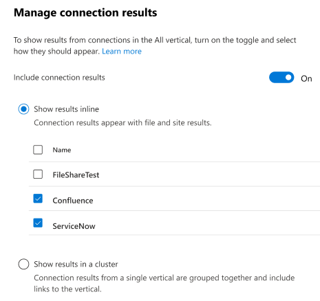
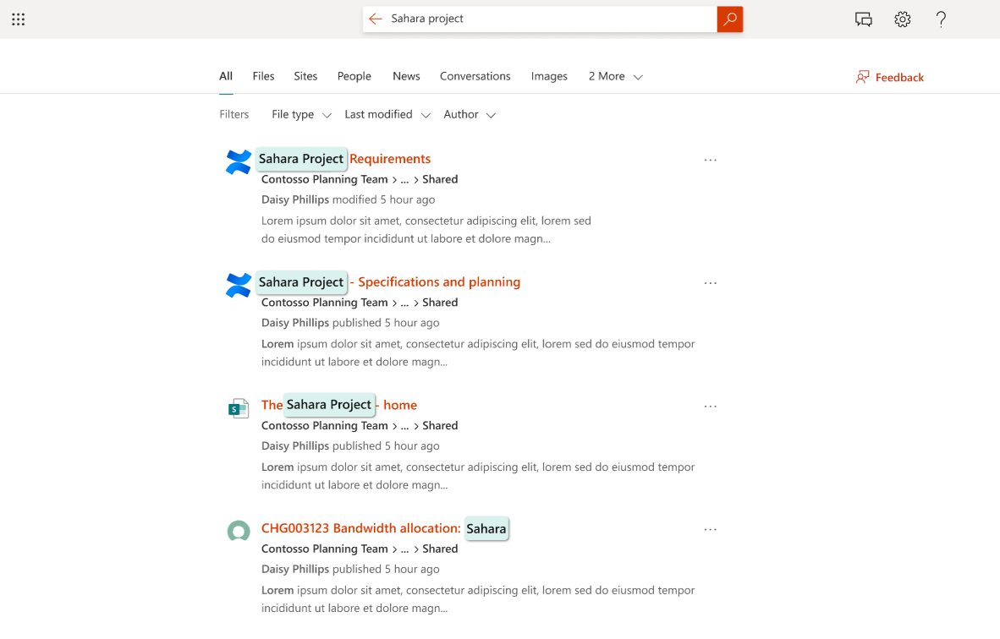
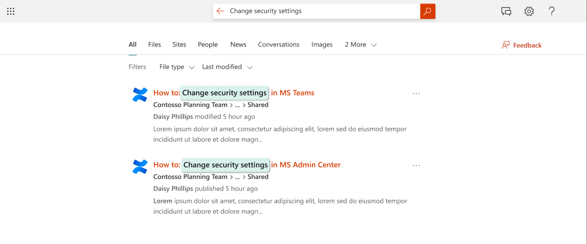
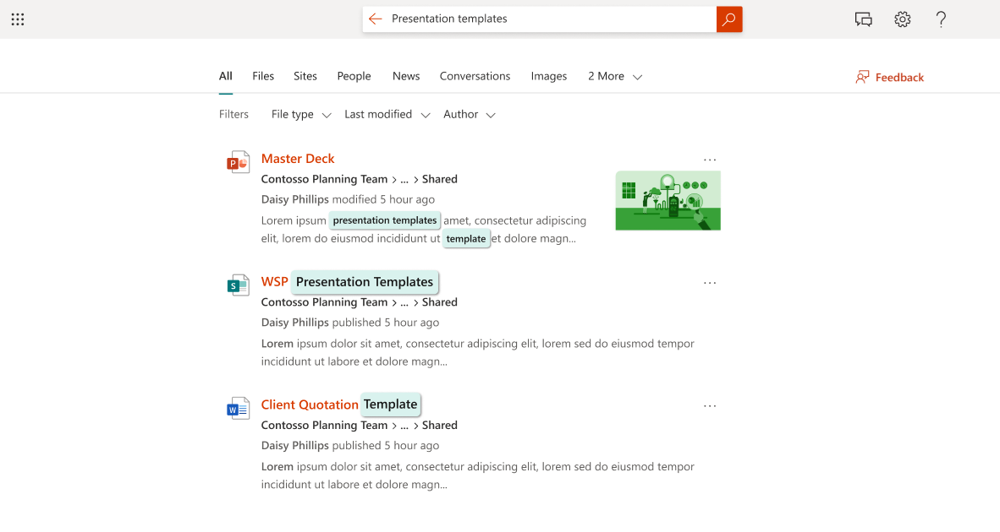

# Manage connector results in All vertical

When you use Graph Connectors to add data sources, your users will be able to search for them in the All vertical by default. They can see the results from Graph Connector data sources merged inline with all the other results from Microsoft apps (for example, SharePoint, OneDrive for Business, or PowerBI) in SharePoint, Office.com, and Microsoft Search in Bing. 
Results in a result cluster are grouped together based on the search vertical configuration. Each result cluster only contains results from a single custom search vertical. To ensure discovery of content in a result cluster, the system expects meaningful titles on your items.

In this example, you can see how Graph Connectors have merged results from Confluence and ServiceNow data sources inline with SharePoint results:  

Inline merging allows users to find relevant content in the search results page from all relevant sources. Graph Connector results are seamlessly integrated into the search page and are ranked by their relevance to the search query. See the table below for a comparison of Graph Connectors in Result cluster versus Inline mode. 

## Result clusters vs. Inline results 

Feature | Result cluster | Inline results
--- | --- | ---
No. of results in All vertical | Max 2 | No cap on number of results |
Availability of connector results on Pages 2 and beyond | No | Yes |
Default filter application (last modified, file type) | No result cluster is shown on filter application | Connector results can appear on filter application |
Requirement of custom vertical | Yes | No custom vertical required – a connection can be enabled for All vertical participation directly |
Deselecting a Graph Connector source from being shown in All vertical | No | Yes |

## Limitations

Connector inline results experience is not available in Microsoft Search in Bing and at SharePoint site search scope. 

## How to view Graph Connector results in All vertical 

### Step 1: Check All vertical setting
1. Inline results for Graph Connector data sources are enabled by default.  
2. To verify the setting, open the Admin Center, go to **Search & Intelligence** > **Customizations** > **Verticals** and select the **All vertical**.
3. In the “Manage Connection results” panel, ensure that the option “Show results inline” is selected and that the connections that you want to enable for the All vertical are checked. 

### Step 2: Check connection schema property settings

Ensure that the connected content meets the following criteria, to show up in All vertical: 
* One of the source properties must be mapped to the semantic label “title”. 
* We recommend assigning a property label of 'lastModifiedDateTime' for this connection where applicable. This will ensure that you're able to filter the content for this connection with the 'Last Modified' filter in the All vertical. 

## How it works

When a user issues a search query, the system returns items from all data sources that are enabled for the All vertical. The system ranks and merges these items to return a single list of relevance-ordered results, which are shown to the user in a paginated list. Please note that inline results are powered by an AI model, that is non-deterministic. This means, the AI model will pay attention to the user query, previous interactions of users in a company with a specific source, and many more features to decide which results are most relevant for the query. The model will be continuously adapted and adjusted based on user interactions, for example, by selecting specific results. 

As a result, a user may see none or many connector results based on the AI models assessment of whether specific items are relevant for each individual query term. 

In this example, the query “Sahara project” shows results from Confluence, SharePoint, and ServiceNow to the user, as there are relevant items with matching titles from these sources: 

In this example, the query “Change security settings” shows results only from Confluence to the user, as there are relevant matching items only in that source: 

In this example, the query “Presentation templates” shows results only from SharePoint, as there are no relevant matching items from any connector data source: 

## Recommendations

* You can contribute to ensure discovery of connector content by attributing the appropriate semantic labels for every connection. Semantic labels help the system identify shared properties (such as title, last modified datetime, created by, and more) across different connections and use these features in ranking items for a given query. 
* You should ensure that Graph Connector search results do not interrupt the users’ habitual scanning patterns. Review the adaptive cards to help determine the appearance and experience of the results in the search result list. For example, 
    * Add an icon to your custom result types – it makes the source of the content transparent to users. 
    * Verify that all results are correctly indented and are vertically aligned.  

## Default setting

Inline results for Graph Connector content in All vertical is turned on by default. 

If you would like to continue using the previous result cluster experience, follow these steps at the organization level: 

1. In the Microsoft 365 admin center, go to Verticals. 
2. Select the All vertical, then in the “Manage connection results” panel, select “Show results in a cluster.” 

If you would like to disable connector results from All vertical completely, follow these steps at the organization level: 

1. In the Microsoft 365 admin center, go to Verticals. 
2. Select the All vertical, then in the “Manage connection results” panel, turn the “Include connector results” toggle off. 
