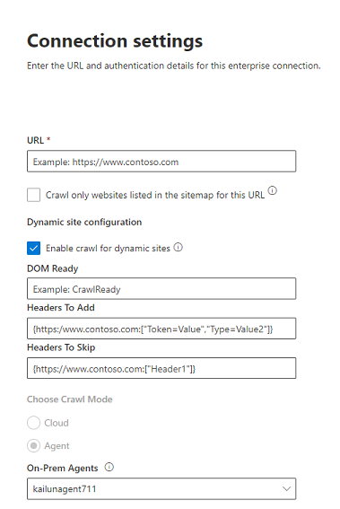
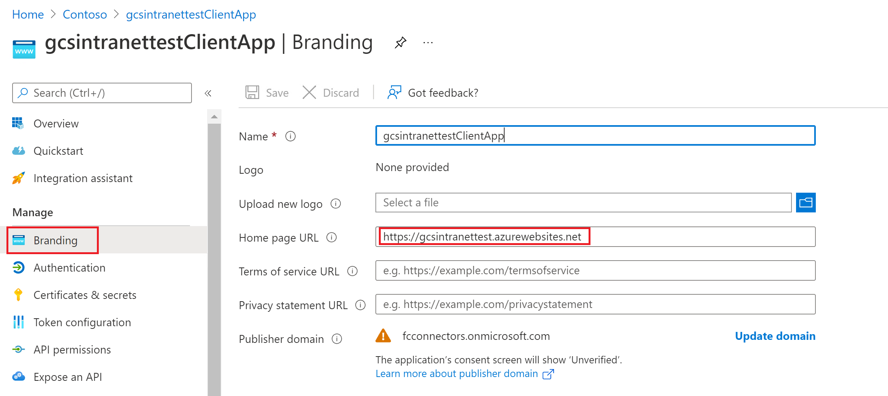
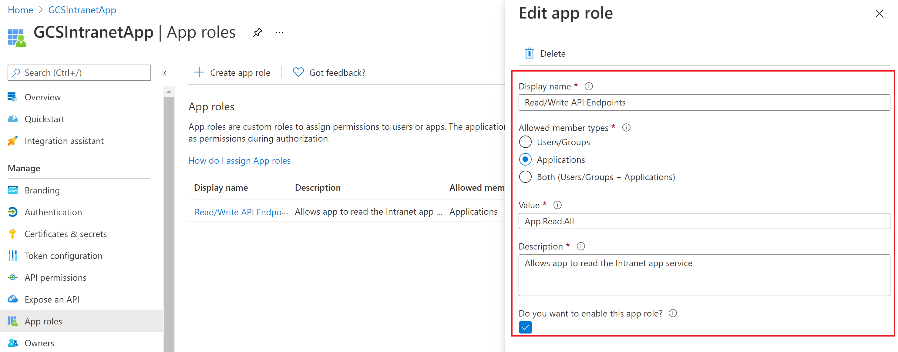
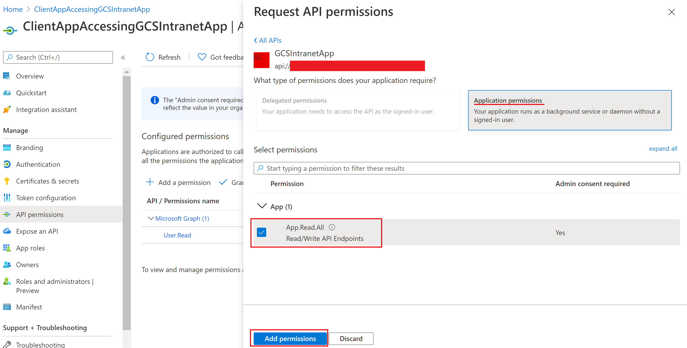

<!---Previous ms.author: monaray --->

<!-- markdownlint-disable no-inline-html -->

# Enterprise websites Microsoft Graph connector

The Enterprise websites Microsoft Graph connector allows your organization to index articles and **content from its internal-facing websites**. After you configure the connector and sync content from the website, end users can search for that content from any Microsoft Search client.

> [!NOTE]
> Read the [**Set up Microsoft Graph connectors in the Microsoft 365 admin center**](configure-connector.md) article to understand the general connectors setup instructions.

This article is for anyone who configures, runs, and monitors an Enterprise websites connector. It supplements the general setup process, and shows instructions that apply only for the Enterprise websites connector. This article also includes information about [Troubleshooting](#troubleshooting).

<!---## Before you get started-->

<!---Insert "Before you get started" recommendations for this data source-->

## Step 1: Add a connector in the Microsoft 365 admin center

Follow the general [setup instructions](./configure-connector.md).
<!---If the above phrase does not apply, delete it and insert specific details for your data source that are different from general setup instructions.-->

## Step 2: Name the connection

Follow the general [setup instructions](./configure-connector.md).
<!---If the above phrase does not apply, delete it and insert specific details for your data source that are different from general setup instructions.-->

## Step 3: Configure the connection settings

To connect to your data source, fill in the root URL of the website and select a custom vertical for the results. After you complete this information, select Test Connection to verify your settings.

### Connection ID

Enter a unique Connection ID name for this data source.

### Website URL

Specify the root of the website that you'd like to crawl. The enterprise websites connector will use this URL as the starting point and follow all the links from this URL for its crawl.

> [!NOTE]
> You can index up to 20 different site URLs in a single connection. In the URLs field, enter the site URLs separated by commas (,). For example, `https://www.contoso.com,https://www.contosoelectronics.com`.

### Use sitemap for crawling

When selected the connector will only crawl the URLs listed in the sitemap. If not selected or no site map is found, the connector will do a deep crawl of all the links found on the root URL of the site.

## Step 3: Advanced settings

Use Advanced settings to enable a dynamic crawler, select a crawl mode, and the type of authentication you'd like to use: None, Basic Authentication, Site Minder, or OAuth 2.0 with [Azure Active Directory (Azure AD)](/azure/active-directory/)

### Dynamic site configuration

If your website contains dynamic content, for example, webpages that live in content management systems like Confluence or Unily, you can enable a dynamic crawler. To turn it on, select **Enable crawl for dynamic sites**. The crawler will wait for dynamic content to render before it begins crawling.

> [!div class="mx-imgBorder"]
> 

In addition to the check box, there are three optional fields available:

1. **DOM Ready**: Enter the DOM element the crawler should use as the signal that the content is fully rendered and the crawl should begin.
1. **Headers to Add**: Specify which HTTP headers the crawler should include when sending that specific web URL. You can set multiple headers for different websites. We suggest including auth token values.
1. **Headers to Skip**: Specify any unnecessary headers that should be excluded from dynamic crawling requests.

> [!NOTE]
> Dynamic crawling is only supported for Agent crawl mode.

### Crawl mode: Cloud or On-premises

The crawl mode determines the type of websites you want to index, either cloud or on-premises. For your cloud websites, select **Cloud** as the crawl mode.

Also, the connector now supports crawling of on-premises websites. To access your on-premises data, you must first install and configure the connector agent. To learn more, see [Microsoft Graph connector agent](./graph-connector-agent.md).

For your on-premises websites, select **Agent** as the crawl mode and in the **On-prem Agent** field, choose the Graph connector agent that you installed and configured earlier.  

### Authentication

**Basic Authentication** requires a username and password.

**SiteMinder** requires a properly formatted URL, ```https://custom_siteminder_hostname/smapi/rest/createsmsession```, a username, and a password. 

**OAuth 2.0** with [Azure AD](/azure/active-directory/) requires a resource ID, Client ID, and a client Secret. OAuth 2.0 only works with Cloud mode.

The resource ID, client ID and client secret values will depend on how you did the setup for Azure Active Directory (Azure AD) based authentication for your website:

1. If you're using an application both as an identity provider and the client app to access the website, the client ID and the resource ID will be the application ID of the app, and the client secret will be the secret that you generated in the app.
    
    > [!NOTE]
    > For detailed steps to configure a client application as an Identity provider, see [Quickstart: Register an application with the Microsoft identity platform and Configure your App Service or Azure Functions app to use Azure AD login](/azure/app-service/configure-authentication-provider-aad).

    After the client app is configured, make sure you create a new client secret by going to the **Certificates & Secrets** section of the app. Copy the client secret value shown in the page because it won't be displayed again.

    In the following screenshots you can see the steps to obtain the client ID, client secret, and set up the app if you're creating the app on your own.
    
    * View of the settings on the branding section:
    
      > [!div class="mx-imgBorder"]
      > [  ](media/enterprise-web-connector//connectors-enterpriseweb-branding.png#lightbox)
    
    * View of the settings on authentication section:
    
      > [!div class="mx-imgBorder"]
      > [  ](media/enterprise-web-connector/connectors-enterpriseweb-authentication.png#lightbox)
    
      > [!NOTE]
      > It is not required to have the above specified route for Redirect URI in your website. Only if you use the user token sent by Azure in your website for authentication you will need to have the route.
    
    * View of the client ID on the **Essentials** section:
    
      > [!div class="mx-imgBorder"]
      > [  ](media/enterprise-web-connector/connectors-enterpriseweb-clientapp-clientidresource-Id.png#lightbox)
    
    * View of the client secret on the **Certificates & secrets** section:
    
      > [!div class="mx-imgBorder"]
      > [  ](media/enterprise-web-connector/connectors-enterpriseweb-client-secret.png#lightbox)
    
2. If you're using an application as an identity provider for your website as the resource, and a different application to access the website, the client ID will be the application ID of your second app and the client secret will be the secret configured in the second app. However, the resource ID will be the ID of your first app.

    > [!NOTE]
    > For steps to configure a client application as an identity provider see [Quickstart: Register an application with the Microsoft identity platform](/azure/active-directory/develop/quickstart-register-app) and [Configure your App Service or Azure Functions app to use Azure AD login](/azure/app-service/configure-authentication-provider-aad).

    You don't need to configure a client secret in this application, but you'll need to add an app role in the **App roles** section of the app which will later be assigned to your client application. In the following screenshots you can see how to add an app role.

    * Creating a new app role:
    
      > [!div class="mx-imgBorder"]
      > [  ](media/enterprise-web-connector/connectors-enterpriseweb-new-app-role.png#lightbox)
    
    * Editing the new app role:
    
      > [!div class="mx-imgBorder"]
      > [  ](media/enterprise-web-connector/connectors-enterpriseweb-new-app-role2.png#lightbox)
    
      After configuring the resource app, you need to create the client app and give it permissions to access the resource app by adding the app role configured above in the API permissions of the client app. 
    
      > [!NOTE]
      > To see how to grant permissions to the client app see [Quickstart: Configure a client application to access a web API](/azure/active-directory/develop/quickstart-configure-app-access-web-apis).
    
    The following screenshots show the section to grant permissions to the client app.
    
    * Adding a permission:
    
      > [!div class="mx-imgBorder"]
      > [  ](media/enterprise-web-connector/connectors-enterpriseweb-adding-permissions.png#lightbox)
    
    * Selecting the permissions:
    
      > [!div class="mx-imgBorder"]
      > [  ](media/enterprise-web-connector/connectors-enterpriseweb-adding-permissions2.png#lightbox)
    
    * Adding the permissions:
 
      > [!div class="mx-imgBorder"]
      > [  ](media/enterprise-web-connector/connectors-enterpriseweb-adding-permissions3.png#lightbox)
    
    Once the permissions are assigned, you'll need to create a new client secret for this application by going to the Certificates & secrets section.
    Copy the client secret value shown in the page as it won't be displayed again. Later use, the application ID from this app as the client ID, the secret from this app as the client secret and application ID of the first app as the resource ID in the admin center.
    
    **Windows authentication** is only available in agent mode. It requires username, domain and password. You need to provide the username and domain in the **Username** field, in any of the following formats: domain\username, or username@domain. A password must be entered in the **Password** field. For Windows authentication, the username provided must also be an administrator in the server where the agent is installed.

## Step 3a: Meta tag settings

The connector fetches any meta tags your root URLs may have and shows them. You can select which tags to include for crawling. 

:::image type="content" source="media/enterprise-web-connector/connectors-enterpriseweb-meta-tags-settings.png" alt-text="Meta tag settings with author, locale, and other tags selected.":::

Selected meta tags will also show up on the Schema page, where you can manage them further (Queryable, Searchable, Retrievable, Refinable).

## Step 3b: Add URLs to exclude (Optional crawl restrictions)

There are two ways to prevent pages from being crawled: disallow them in your robots.txt file or add them to the Exclusion list.

### Support for robots.txt

The connector checks to see if there's a robots.txt file for your root site and, if one exists, it will follow and respect the directions found within that file. If you don't want the connector to crawl certain pages or directories on your site, you can call out those pages or directories in the "Disallow" declarations in your robots.txt file.

### Add URLs to exclude

You can optionally create an **Exclusion list** to exclude some URLs from getting crawled if that content is sensitive or not worth crawling. To create an exclusion list, browse through the root URL. You can add the excluded URLs to the list during the configuration process.

## Step 4: Assign property labels

You can assign a source property to each label by choosing from a menu of options. While this step isn't mandatory, having some property labels will improve the search relevance and ensure more accurate search results for end users.

## Step 5: Manage schema

On the **Manage Schema** screen, you can change the schema attributes (the options are **Query**, **Search**, **Retrieve**, and **Refine**) associated with the properties, add optional aliases, and choose the **Content** property.

## Step 6: Manage search permissions

The Enterprise websites connector only supports search permissions visible to **Everyone**. Indexed data appears in the search results and is visible to all users in the organization.

## Step 7: Set the refresh schedule

The Enterprise websites connector only supports a full refresh. This means that the connector will recrawl all the website's content during every refresh. To make sure the connector gets enough time to crawl the content, we recommend that you set a large refresh schedule interval. We recommend a scheduled refresh between one and two weeks.

## Step 8: Review connection

Follow the general [setup instructions](./configure-connector.md).
<!---If the above phrase does not apply, delete it and insert specific details for your data source that are different from general setup instructions.-->

## Troubleshooting

When reading the website's content, the crawl may encounter some source errors, which are represented by the detailed error codes below. To get more information on the types of errors, go to the **error details** page after selecting the connection. Select the **error code** to see more detailed errors. Also refer to [Monitor your connections](./manage-connector.md) to learn more.

 Detailed Error code | Error message
 --- | ---
 6001 | The site that is being tried to index isn't reachable
 6005 | The source page that is being tried to index has been blocked by as per robots.txt configuration.
 6008 | Unable to resolve the DNS
 6009 | For all client-side errors (Except HTTP 404, 408), refer to HTTP 4xx error codes for details.
 6013 | The source page that is being tried to index couldn't be found. (HTTP 404 error)
 6018 | The source page isn't responding, and the request has timed out. (HTTP 408 error)
 6021 | The source page that is being tried to index has no textual content on the page.
 6023 | The source page that is being tried to index is unsupported (not an HTML page)
 6024 | The source page that is being tried to index has unsupported content.

* Errors 6001-6013 occur when the data source isn't reachable due to a network issue or when the data source itself is deleted, moved, or renamed. Check if the data source details provided are still valid.
* Errors 6021-6024 occur when the data source contains non-textual content on the page or when the page isn't an HTML. Check the data source and add this page in exclusion list or ignore the error.
