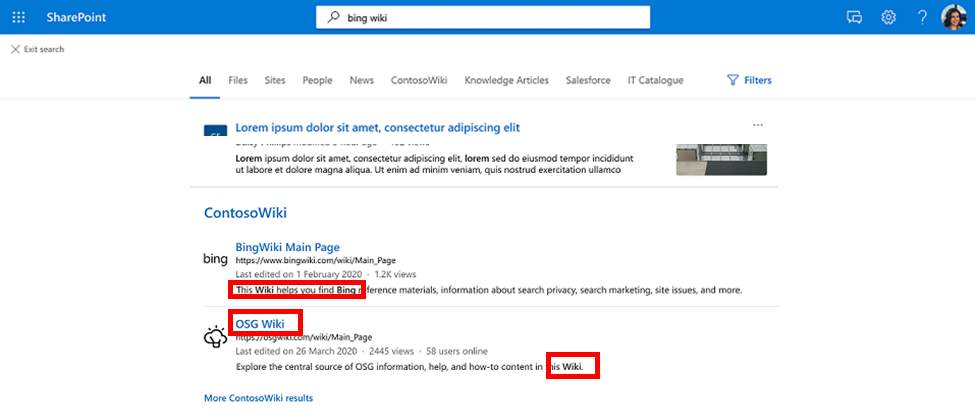

# Manage result clusters

With Graph connectors result clusters, you can search for content from third-party data sources in the All tab, in SharePoint, Office.com, and Microsoft Search in Bing. 

Results in a result cluster are grouped together based on the search vertical configuration. Each result cluster only contains results from a single custom search vertical. To ensure discovery of content in a result cluster, the system expects meaningful titles on your items.

Result clusters are displayed on the All vertical and can include a maximum of two results from a custom vertical. These SharePoint results for the query bing wiki include a result cluster from the ContosoWiki vertical with two relevant results, titled 'BingWiki Main page' and 'OSG Wiki'. 

## Check list for result clusters
### Step 1: Check connection schema property settings
Ensure that the connected content meets the following two criteria, to show up in a result cluster:

1.	The external connection and its items must have the (body) [“content” property](/graph/api/resources/externalconnectors-externalitem?view=graph-rest-beta#properties) populated with textual content. The content property should be a meaningful and plain-text representation of the item.
2.	One of the source properties must be mapped to the [semantic label “title”](configure-connector.md?#step-6-assign-property-labels).

### Step 2: Check result type definition to adjust the user experience

You control how the results appear in the result cluster by defining a [result type](/microsoftsearch/manage-result-types). If no result type is configured, a  system generated layout is used.

### Step 3: Verify a result cluster appears on the All results page

Each result cluster includes a heading with the name of the custom vertical and a link to the custom vertical (‘more _CustomVerticalName_ results’). 
> [!NOTE] 
> Note that you can see updates related to result clusters, for example, schema updates or experience modifications via result cluster, after some time (~10 minutes). 

### How connector results are selected and displayed
When you search, the system identifies which custom vertical has the most relevant content results for the query. For each item in the custom vertical, the system looks at the title, the displayed content property and extent of query overlap with them. Based on the overlap, the top two ranked results from that vertical appear in a result cluster.

In this example, the query term 'bing wiki' occurs in both titles and the displayed body content of the results. Because of the overlap, they are included in a result cluster.

> [!NOTE]
> For single term-queries the likelihood is low that a result cluster is shown with an item whose title or body content does not contain the single query term. Of course, for longer queries where only one query term matches the item’s title or body content, the likelihood that a result cluster is shown is higher. 
>
> In some cases an overlap in just the title or only the content triggers a result cluster because there are no higher relevant results on other verticals.
> 
> Even if there was an overlap in both title and content, a result cluster might not be shown for a specific custom vertical because other custom verticals have results with higher overlap in title and content properties.

### Recommendations
To ensure discovery of content from the search verticals, we recommend attributing the semantic label “title” to a property that describes the item and functions as the “title” of an item. The "content" property should also represent the item, for example, it could be the description of the items of a connection. Choosing both the title and content properties will provide the best experience for your users through accurate triggering of the result cluster and most relevant results in the result cluster.

> [!TIP]
> Ensure meaningful titles are provided for the items, which summarize the item well. This increases the likelihood of the desired content showing up in a result cluster. For example, avoid the use of IDs as values for the property "title" unless your users are using IDs to look for content.
> 
> If the content does not have meaningful titles, a custom field can be created that describes the content better and can function as “title”. 
>
> Ensure that the body “content” of the items is also a meaningful, representative summary or description of the item. Concatenating disjoint pieces of text in content can have an inverse effect on the result cluster triggering.

## Result clusters default settings
  
The result cluster experience is turned on by default.  

If you would like to disable it, follow these steps to turn off the experience at the organization level:

1. In the [Microsoft 365 admin center](https://admin.microsoft.com), go to [**Verticals**](https://admin.microsoft.com/Adminportal/Home#/MicrosoftSearch/verticals).
1. Select  the **All** vertical, then enable **Hide connector results**.

Follow these steps to turn off the experience at the SharePoint site level:

1. Go to **Settings** in the SharePoint site
2. Go to **Site information**>**View all site settings**.
3. Go to the Microsoft Search section, then select **Configure Microsoft Search for this site collection**.
4. In the navigation pane, go to **Custom experience**, then select **Verticals**.
5. Select the **All** vertical, then enable **Hide connector results**.
