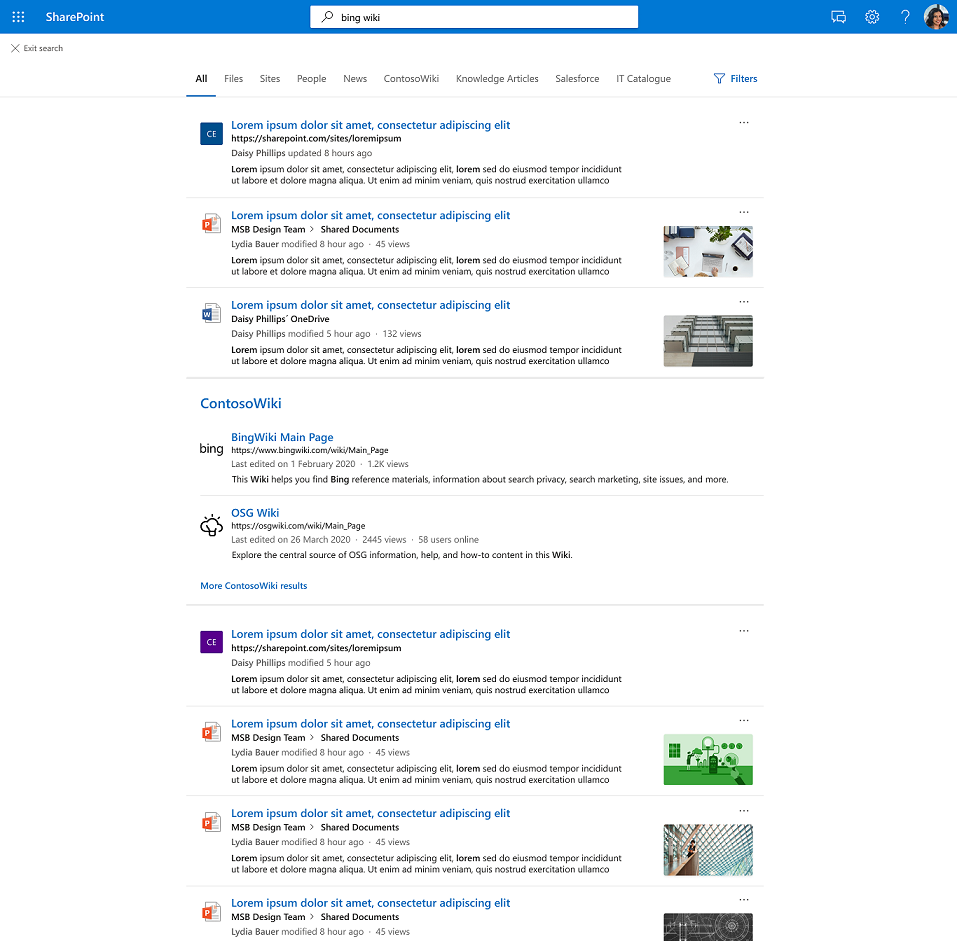

# Graph connectors result cluster

## Overview of the Graph connectors result cluster  

With Graph connectors result clusters, you can search for content from third-party data sources in the **All** tab, in SharePoint, Office.com, and Microsoft Search in Bing.

Result clusters help users discover all content in one place. The results shown in a result cluster are grouped together based on the search vertical configuration.

## How connector results are selected and displayed

Connected content needs to meet the following two criteria to be able to show up in a result cluster: 
1.	The external items need to have adequate data ingested into the [“content” property](/graph/api/resources/externalconnectors-externalitem?view=graph-rest-beta#properties) of the item.
1.	One of the source properties must be mapped to the [semantic label “title”](/configure-connector?#step-6-assign-property-labels).

Connector results provided in the result cluster come from individual search verticals with connector content. Each search vertical provides a set of relevant results which becomes a candidate result cluster. Relevant results are chosen based on query terms that overlap with the "title" and "content" properties of each item. 

To ensure discovery of content from the search verticals, we recommend providing meaningful titles for your items. This positively impacts the arbitration of result cluster candidates and the likelihood of your content showing up in a result cluster. For example, avoid the use of IDs as values for the property "title" unless your users are using IDs to look for content.

How often a result cluster is shown depends on factors such as the number of search verticals that you configure and the type of content. By either interacting or ignoring a result cluster, users are implicitly provide hints that will adjust its triggering over time.

The search result experience for connector items shown in your result cluster uses [result types](./customize-search-page.md#create-your-own-result-type) defined by you. If no result type is configured, a [system generated layout](./customize-search-page.md#default-search-result-layout) is used.

We recommend using the “title” property as the search result title and the "content" property as the search description. This will provide the best experience for your users through accurate triggering of the result cluster and most relevant results in the cluster.

Result clusters are displayed in the middle of page on the All vertical. For example, a result cluster from a 'MediaWiki' vertical is displayed below.

## Result clusters default settings
  
The result cluster experience is turned on by default.  

If you would like to disable it, follow these steps to turn off the experience at the organization level:

1. In the [Microsoft 365 admin center](https://admin.microsoft.com), go to [**Verticals**](https://admin.microsoft.com/Adminportal/Home#/MicrosoftSearch/verticals).
1. Select  the **All** vertical, then enable **Hide connector results**.

Follow these steps to turn off the experience at the SharePoint site level:

1. Go to **Settings** in the SharePoint site
2. Go to **Site information**>**View all site settings**.
3. Go to the Microsoft Search section, then select **Configure Microsoft Search for this site collection**.
4. In the navigation pane, go to **Custom experience**, then select **Verticals**.
5. Select the **All** vertical, then enable **Hide connector results**.
