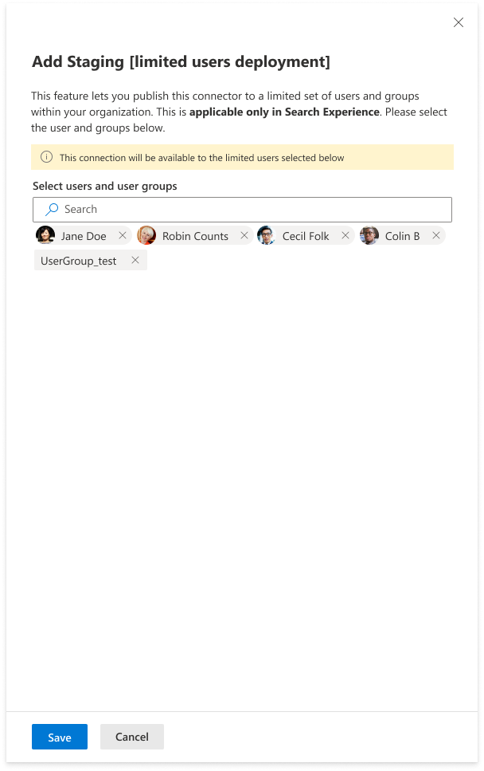
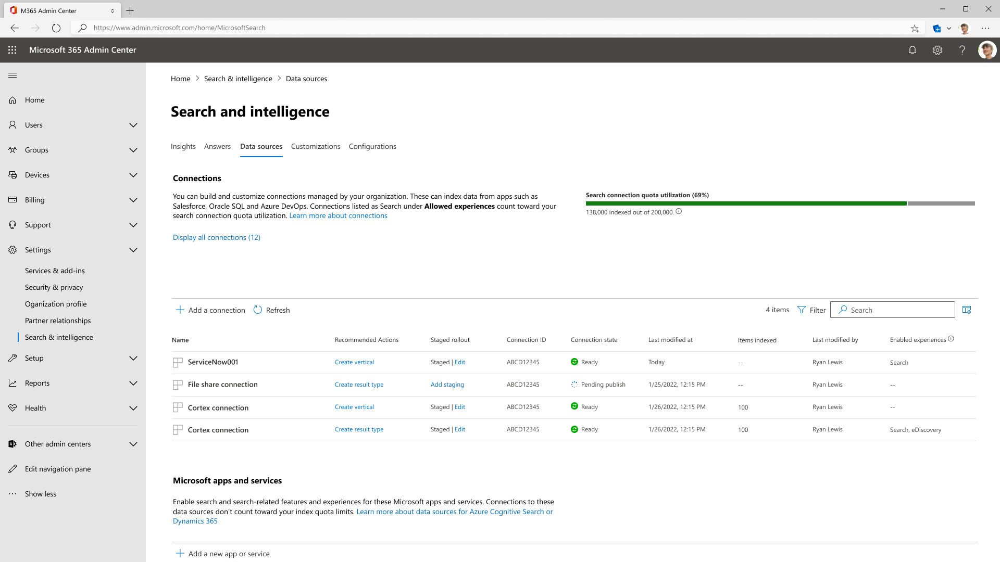
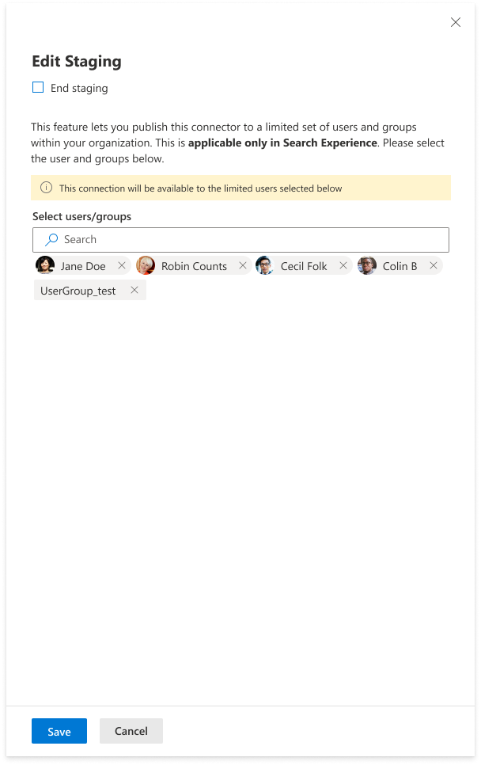

--- 
ms.date: 10/26/2023
title: "Staged Rollout for Graph Connectors" 
ms.author: souravpoddar001 
author: souravpoddar001 
audience: Admin
ms.audience: Admin 
ms.topic: article 
ms.service: mssearch 
ms.localizationpriority: medium 
search.appverid: 
- BFB160 
- MET150 
- MOE150 
description: "Use Stage Rollout to gradually rollout a Graph Connector to your users" 
---

# Staged Rollout for Graph connectors

Staged rollout is a feature that allows you to gradually introduce Graph Connectors to a select group of users in your production environment. 

Graph Connectors enable you to connect and index data from various external sources, such as ServiceNow, Salesforce, Azure Data Lake Storage, Jira Cloud, Confluence Cloud, and more. With Graph Connectors, you can enrich your Microsoft Search experience with relevant and diverse content from your organization.

> [!NOTE]
> Read the [**Setup for your Microsoft Graph connector**](configure-connector.md) article to understand the general connectors setup instructions.

This document will guide you through the steps to apply staged rollout to a connection, monitor and modify the rollout, and remove the rollout if needed.

>[!IMPORTANT]
>You must be a Search Admin, Global Admin or Search Editor to access this feature.

<!---## Steps to apply staged rollout to a connection-->
## Steps to apply staged rollout to a connection

Go to the [M365 admin center](https://admin.microsoft.com).

## Step 1: Navigate to the Search & Intelligence portal

Click on the **Show all** link on the left hand panel and select **Search & Intelligence** under the **Settings** section.
<!---If the above phrase does not apply, delete it and insert specific details for your data source that are different from general setup 
instructions.-->

## Step 2: Select the connection

Navigate to the **Data Sources** tab and select the connection you want to apply staged rollout to. If you have not created a connection yet, follow the [general setup instructions](./configure-connector.md) to create a connection.
<!---If the above phrase does not apply, delete it and insert specific details for your data source that are different from general setup 
instructions.-->

## Step 3: Configure the connection settings

Once you have configured all the connection settings, on the **Review & Publish** step, you’ll see a new button ‘Publish to limited users’ allowing you to deploy the connector to a limited audience. Click on this button.

## Step 4: Add users or M365 groups

Add the users or security groups who you’d like to give access to the connector. Currently, you can add up to 100 users and 15 M365 groups. Learn more about M365 groups [here](https://learn.microsoft.com/en-us/microsoft-365/admin/create-groups/office-365-groups?view=o365-worldwide).

## Step 5: Review changes

After adding the list of users or groups for a given connection, click **Save** to apply your changes. The portal will show you a confirmation screen with the list of users and groups included in the deployment.

## Step 6: Publish the connection

Click on **Publish to limited users** to complete the connection set-up.

The portal will start the staged rollout process. Depending on the size of your organization and the number of users selected, this may take some time. You can check the status on the **Display all connections** section in the **Data sources** tab. Once the connection is published, only the users who are included in the rollout will be able to see the connector results (if they have access permissions) in Microsoft Search.

<!---If the above phrase does not apply, delete it and insert specific details for your data source that are different from general setup 
instructions.-->

## Steps to modify or stop staged rollout

## Step 1: Navigate to the Data Sources tab

In the **Display all connections** section, you will see a new column in the connection table – **Staged rollout**.

<!---If the above phrase does not apply, delete it and insert specific details for your data source that are different from general setup 
instructions.-->

## Step 2: Check the status in the Staged rollout column

Connections which are currently staged will show the status - ‘Staged’ in the Staged rollout column.

## Step 3: Add or remove users
You can click on **Edit** to add or remove users from the staged rollout.

### Stop the Staged Rollout
If you want to stop the staged rollout and are ready to deploy the connection to the entire organization, click on **Edit** in the staged rollout column. On the Staged rollout settings panel, click on the **End staging** button.

In the confirmation modal, click on **End** to confirm the action. Please note that on ending staging, the connection results will start ***appearing to everyone in the organization or those who have access to the items*** (this will depend on the option you have chosen in the ‘Manage search permissions’ section in the [connection creation flow](https://learn.microsoft.com/en-us/microsoftsearch/configure-connector).

## Limitations

The Staged rollout feature has the following limitations in the currrent release:

- You can only add up to 100 users and 15 M365 groups to the staged rollout list.
- The Staged Rollout settings are currently only applicable to Search and Copilot experiences.

## Conclusion

Staged rollout is a powerful and flexible way to introduce Graph Connectors to your organization. It also reduces the risk of disrupting your existing search experience and allows you to fine-tune your connection settings before you roll it out to the entire organization. We hope you find this feature useful and valuable.

<!---Insert limitations for this data source-->

