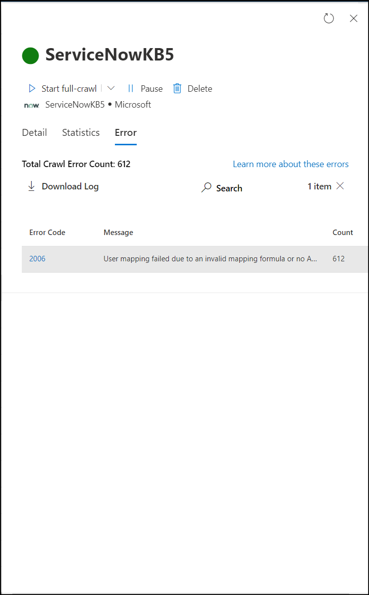

# Troubleshooting guide for ServiceNow Knowledge Microsoft Graph connector

### 1. **Not able to find ServiceNow Knowledge articles in Copilot or Microsoft Search.**
   
   

    
Follow the troubleshooting steps below to identify the root cause.
 

    1. Check if the user searching for the article has the required permissions to access the ServiceNow Knowledge articles. You can do that by using the [User criteria diagnostics](https://docs.servicenow.com/bundle/washingtondc-servicenow-platform/page/product/knowledge-management/concept/diagnose-knowledge-user-criteria.html) tool in ServiceNow.

    2. If the user has access to the article in ServiceNow, check if the user is correctly mapped to a Microsoft Entra identity. This will usually show as a '2006' error in the Error tab. Check the user mapping formula and if needed change the mapping method. 

        

    3. If the user is correctly mapped to an identity, check if there is an Advanced script in any of the user criteria granting access to the article. (Note: Advanced scripts are not supported in the current version of Microsoft Graph connector for ServiceNow.)
          1. If there is an Advanced script configured in any of the '_Cannot Read_' or '_Cannot Contribute_' user criteria in the knowledge base level (to which the article belongs to) all articles in the knowledge base are stamped with deny access in the indexed data.

          2. If there is an Advanced script configured in any of the '_Cannot Read_' user criteria in the article level, the article is stamped with deny access in the indexed data.

    4. If there is no advanced script present in any of the user criteria, check if there is an empty criteria (user criteria with empty fields) present at the knowledge base level ('_Cannot Read_', "_Cannot Contribute_') or at the article level ('_Cannot Read_'). If there is an empty criteria present, the article is stamped with deny access in the indexed data.

    5. If you are still not able to identify the root cause, please reach out to [the Microsoft Graph connector support team](mailto:MicrosoftGraphConnectorsFeedback@service.microsoft.com) with the following details.
       1. Tenant ID
       2. Connection ID
       3. Article Sys ID
       4. Knowledge Base Sys ID
       5. For the above knowledge base collect:
            1. List of user criteria sys_id available in the kb_uc_can_read_mtom (Who Can Read Knowledge Base) table
            2. List of user criteria sys_id available in the kb_uc_cannot_read_mtom (Who Cannot Read Knowledge Base) table
            3. List of user criteria sys_id available in the kb_uc_cannot_contribute_mtom (Who Cannot Contribute To Knowledge Base) table
            4. List of user criteria sys_id available in the kb_uc_can_contribute_mtom 
        6. Also, for the Item sys_id collected in step 3, please share:
            1. List of user criteria sys_id in the can_read_user_criteria field of the article
            2. List of user criteria sys_id in the cannot_read_user_criteria field of the article

  
### 2. Unable to log in due to Single Sign-On enabled ServiceNow instance
    
If your organization has enabled Single Sign-On (SSO) to ServiceNow, you may have trouble logging in with the service account. You can bring up username and password based login by adding <em> `login.do`</em> to the ServiceNow instance URL. Example. `https://<your-organization-domain>.service-now.com./login.do`

### 3. Unauthorized or forbidden response to API request

